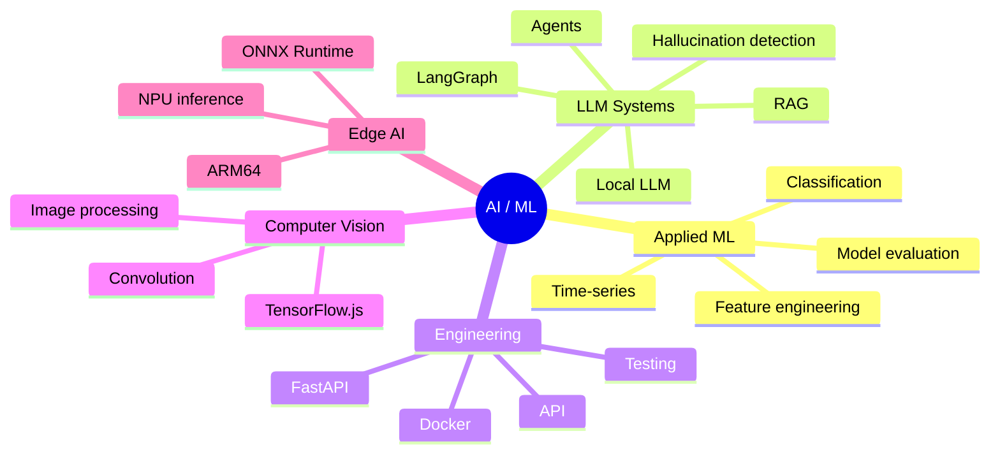

# Hi, I'm Stavr Moris 👋

**Junior ML / AI Engineer**  
First-year student at Novosibirsk State University. Interested in applied machine learning, LLM systems, RAG, AI agents, model evaluation, and inference.

**Languages:** [English](README.md) · [Русский](README.ru.md) · [中文](README.zh.md)

---

## About me

I am developing in the field of **Machine Learning / AI Engineering** and focus on projects where ML models or LLM-based systems are placed into a clear engineering context: with quality evaluation, API, demo interface, reproducible launch, and documentation.

My current interests include:

- hallucination detection and LLM evaluation;
- RAG and agentic workflows;
- applied ML for real-world tasks;
- time-series forecasting;
- inference and running models in constrained environments;
- computer vision and image processing.

---

## Tech Stack

### ML / Data Science
`Python` `PyTorch` `CatBoost` `scikit-learn` `Logistic Regression` `PCA` `TF-IDF` `LSTM` `feature engineering`

### LLM / RAG / Agents
`LangGraph` `LangChain` `ChromaDB` `Ollama` `Qwen` `GigaChat API` `OpenRouter` `MCP` `RAG` `embeddings` `reranking`

### Backend / Tools
`FastAPI` `Django` `Django REST Framework` `Docker` `Docker Compose` `pytest` `Git` `Linux`

### CV / Low-level / Edge AI
`C` `image processing` `TensorFlow.js` `ONNX Runtime` `ARM64 Linux` `NPU inference`

---

## Achievements

- 2nd place in the Avito track at **IT Purple Hack 2026**
- 3rd place in the Sber track with a GigaChat hallucination detection solution
- 3rd place at **Cloud.ru Hackathon**
- 3rd place at **T1 Hackathon**

---

## Key Projects

### Guardian of Truth — GigaChat Hallucination Detection

**Repository:** [Ultramind-67/purple_hack_sber](https://github.com/Ultramind-67/purple_hack_sber)

A competitive ML solution for detecting factual hallucinations in GigaChat answers.  
The approach does not rely on external LLM-as-a-judge methods or RAG. Instead, it analyzes internal model signals.

Used in the project:

- hidden-state probing;
- teacher forcing;
- contrast directions;
- PCA-compressed representations;
- uncertainty features from logits;
- lightweight Logistic Regression classifier.

**Results:**

- 3rd place in the Sber track;
- public PR-AUC: 0.8493;
- private PR-AUC: around 0.8541.

**Stack:** Python, PyTorch, scikit-learn, PCA, Logistic Regression, GigaChat, hidden-state features.

---

### Avito Split Detector — Hybrid ML Service for Ad Classification

**Repository:** [Ultramind-67/avito_hack_solution](https://github.com/Ultramind-67/avito_hack_solution)

A hackathon solution for an Avito case: the system determines when a repair-service ad should be split into several separate service ads and can optionally generate draft ads.

Solution architecture:

- rule-based microcategory detector;
- TF-IDF text features;
- hand-crafted meta-features;
- CatBoost classifier;
- FastAPI API;
- optional LLM-based draft generation via OpenRouter;
- fallback mode without an external LLM API.

**Results:**

- 2nd place in the track;
- historical hold-out F1: 0.70;
- Precision: 0.81 for the Split class.

**Stack:** Python, CatBoost, scikit-learn, TF-IDF, FastAPI, OpenRouter, pytest.

---

### LocalScript AI Agent — Offline LLM Agent for Lua Scripts

**Repository:** [Ultramind-67/lua-ai-agent](https://github.com/Ultramind-67/lua-ai-agent)

A local agent system for generating, validating, and iteratively improving Lua scripts for a LowCode platform.

The project was developed for an isolated environment: the system works without internet access and without APIs from external LLM providers.

Main components:

- local inference via Ollama;
- Qwen2.5-Coder 7B with 4-bit quantization;
- LangGraph pipeline;
- syntax checking with `luac`;
- static analysis with `luacheck`;
- self-reflection loop for fixing errors;
- lightweight RAG based on keyword scoring;
- FastAPI backend and simple web interface;
- Docker Compose launch.

**Stack:** Python, FastAPI, LangGraph, Ollama, Qwen2.5-Coder, Lua, luac, luacheck, Docker.

---

### CdekStart RAG Agent — Contextual RAG Bot

**Repository:** [stavrmoris/cdek_rag_bot](https://github.com/stavrmoris/cdek_rag_bot)

A RAG chatbot service for consulting users about international internship rules.  
The project is built with FastAPI, LangGraph, and ChromaDB.

Implemented:

- stateful dialogue memory via `thread_id`;
- RAG search over a local vector database;
- metadata filtering by location;
- smart routing between answering and asking clarifying questions;
- support for different LLMs through an adapter;
- Docker Compose launch.

**Stack:** Python, FastAPI, LangGraph, LangChain, ChromaDB, HuggingFace Embeddings, Docker.

---

### Demand Forecasting ML Service

**Repository:** [stavrmoris/LSTM_m5_NSU](https://github.com/stavrmoris/LSTM_m5_NSU)

An educational NSU project focused on building an ML service for product demand forecasting using sales time series.

The project implements a complete small ML-service pipeline:

- data preparation;
- `mean-28` baseline;
- Global LSTM with PyTorch;
- evaluation on a holdout period;
- FastAPI backend for inference;
- React dashboard for forecast visualization;
- Docker Compose launch.

**Result:**

- MAE improvement of about 16.8% compared to the baseline.

**Stack:** Python, PyTorch, LSTM, pandas, scikit-learn, FastAPI, React, Docker.

---

### Orange Pi 6 Plus Alt Linux NPU — ML Inference on NPU

**Repository:** [Ultramind-67/orange-pi-6-plus-alt-linux-npu](https://github.com/Ultramind-67/orange-pi-6-plus-alt-linux-npu)

A project for the NSU AI Center at the intersection of ML inference, ARM64 Linux, and edge AI.  
The goal was to run a neural network model on Orange Pi 6 Plus under Alt Linux using the hardware NPU.

Covered in the project:

- running Alt Linux on an ARM64 board;
- working with the vendor CIX/Orange Pi BSP kernel;
- configuring NPU drivers;
- CIX NOE SDK;
- Python environment for inference;
- ONNX Runtime Zhouyi;
- running ResNet50 via the hardware NPU.

**Stack:** Alt Linux, ARM64, Linux kernel, CIX NOE SDK, ONNX Runtime Zhouyi, Python, Conda, NPU inference.

---

### imgproc — Image Processing Library in C

**Repository:** [stavrmoris/imgproc](https://github.com/stavrmoris/imgproc)

An educational NSU project: a command-line application and C library for basic image processing.

Implemented:

- median filter;
- Gaussian blur;
- Sobel edge detection;
- sharpen;
- arbitrary 2D convolution;
- CLI interface;
- Makefile build;
- unit tests.

**Stack:** C, Makefile, stb_image, image processing, convolution filters, unit tests.

---

### Dion Background Lab — Real-time Computer Vision in Browser

**Repository:** [Ultramind-67/solution_T1_hack](https://github.com/Ultramind-67/solution_T1_hack)

A hackathon prototype for dynamic background replacement in video calls.  
The application works in the browser: it gets webcam video, segments the person, and renders the final frame through Canvas.

Implemented:

- webcam video processing;
- person segmentation with TensorFlow.js;
- background replacement modes;
- blur, images, and video backgrounds;
- FPS counter;
- Docker/nginx launch.

**Result:** 3rd place at T1 Hackathon.

**Stack:** JavaScript, TensorFlow.js, Canvas API, HTML, CSS, Docker, nginx.

---

### AI Procurement Agent — Multi-agent Procurement System

**Repository:** [Ultramind-67/hack_mcp_cloud_ru](https://github.com/Ultramind-67/hack_mcp_cloud_ru)

A hackathon multi-agent solution for automating procurement workflows.  
The system combines LLMs, RAG memory, web search, supplier website scraping, logistics calculation, and reporting.

Implemented:

- MCP architecture;
- ReAct-style agent loop;
- supplier search;
- website analysis via Jina AI;
- RAG memory with ChromaDB;
- integration with DPD SOAP/XML API;
- CSV report generation;
- Streamlit dashboard.

**Result:** 3rd place at Cloud.ru Hackathon.

**Stack:** Python, FastMCP, AsyncIO, ChromaDB, Qwen, Jina AI, SOAP/XML, Streamlit, Docker.

---

## Map of Interests

---

## Current Interests

- ML Engineering;
- LLM / RAG Engineering;
- AI agents;
- model evaluation;
- inference services;
- applied ML;
- projects at the intersection of models and backend engineering.

---

## Contacts

- Telegram: [@stavrmoris](https://t.me/stavrmoris)
- Email: `s.mariskin@g.nsu.ru`
- GitHub: [github.com/stavrmoris](https://github.com/stavrmoris)
