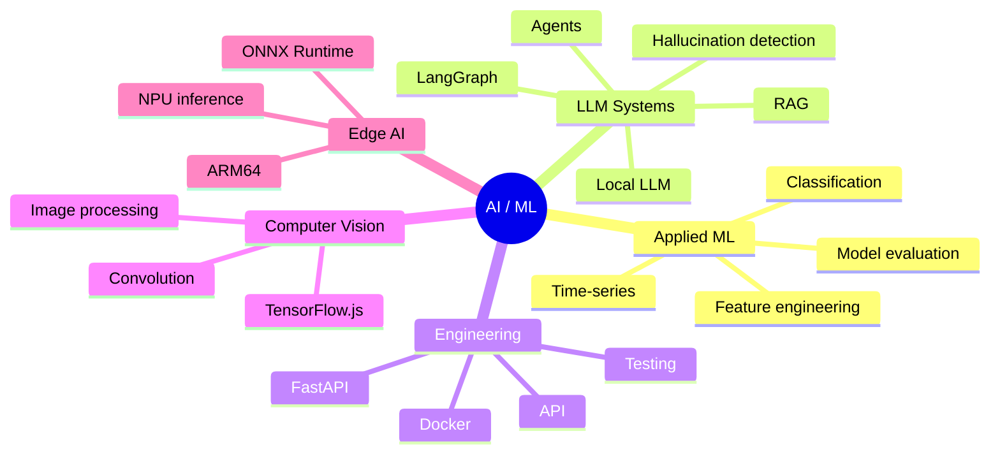

# Привет, я Ставр Марискин 👋

**Junior ML / AI Engineer**  
Студент 1 курса НГУ. Интересуюсь прикладным машинным обучением, LLM-системами, RAG, AI-агентами, оценкой качества моделей и inference.

**Языки:** [English](README.md) · [Русский](README.ru.md) · [中文](README.zh.md)

---

## Обо мне

Я развиваюсь в направлении **Machine Learning / AI Engineering** и стараюсь делать проекты, где модель или LLM-система встроены в понятный инженерный контекст: с оценкой качества, API, демонстрационным интерфейсом, воспроизводимым запуском и документацией.

Сейчас мне особенно интересны:

- детекция галлюцинаций и оценка качества LLM;
- RAG и agentic workflows;
- applied ML для прикладных задач;
- time-series forecasting;
- inference и запуск моделей в ограниченных средах;
- computer vision и обработка изображений.

---

## Технический стек

### ML / Data Science
`Python` `PyTorch` `CatBoost` `scikit-learn` `Logistic Regression` `PCA` `TF-IDF` `LSTM` `feature engineering`

### LLM / RAG / Agents
`LangGraph` `LangChain` `ChromaDB` `Ollama` `Qwen` `GigaChat API` `OpenRouter` `MCP` `RAG` `embeddings` `reranking`

### Backend / Tools
`FastAPI` `Django` `Django REST Framework` `Docker` `Docker Compose` `pytest` `Git` `Linux`

### CV / Low-level / Edge AI
`C` `image processing` `TensorFlow.js` `ONNX Runtime` `ARM64 Linux` `NPU inference`

---

## Достижения

- 2 место в треке Avito на IT Purple Hack 2026
- 3 место в треке Сбера с решением по детекции галлюцинаций GigaChat
- 3 место на Cloud.ru Hackathon
- 3 место на T1 Hackathon

---

## Ключевые проекты

### Guardian of Truth — детекция галлюцинаций GigaChat

**Репозиторий:** [Ultramind-67/purple_hack_sber](https://github.com/Ultramind-67/purple_hack_sber)

Конкурсное ML-решение для определения фактологических галлюцинаций в ответах GigaChat.  
Подход основан не на внешнем LLM-as-a-judge и не на RAG, а на анализе внутренних сигналов модели.

В проекте использовались:

- hidden-state probing;
- teacher forcing;
- contrast directions;
- PCA-сжатие представлений;
- uncertainty-признаки из logits;
- лёгкий Logistic Regression классификатор.

**Результат:**

- 3 место в треке Сбера;
- public PR-AUC: 0.8493;
- private PR-AUC: около 0.8541.

**Стек:** Python, PyTorch, scikit-learn, PCA, Logistic Regression, GigaChat, hidden-state features.

---

### Avito Split Detector — гибридный ML-сервис для классификации объявлений

**Репозиторий:** [Ultramind-67/avito_hack_solution](https://github.com/Ultramind-67/avito_hack_solution)

Хакатонное решение для кейса Авито: система определяет, когда объявление о ремонте стоит разделить на несколько отдельных услуг, и при необходимости генерирует черновики новых объявлений.

Архитектура решения:

- rule-based детектор микрокатегорий;
- TF-IDF признаки текста;
- ручные meta-features;
- CatBoost-классификатор;
- FastAPI API;
- опциональная LLM-генерация черновиков через OpenRouter;
- fallback-режим без внешнего LLM API.

**Результат:**

- 2 место в треке;
- historical hold-out F1: 0.70;
- Precision: 0.81 для класса Split.

**Стек:** Python, CatBoost, scikit-learn, TF-IDF, FastAPI, OpenRouter, pytest.

---

### LocalScript AI Agent — offline LLM-агент для Lua-скриптов

**Репозиторий:** [Ultramind-67/lua-ai-agent](https://github.com/Ultramind-67/lua-ai-agent)

Локальная агентская система для генерации, проверки и итеративного улучшения Lua-скриптов под LowCode-платформу.

Проект разрабатывался с ограничением на изолированный контур: система работает без внешнего интернета и без API внешних LLM-провайдеров.

Основные компоненты:

- локальный inference через Ollama;
- Qwen2.5-Coder 7B в 4-bit квантизации;
- LangGraph pipeline;
- синтаксическая проверка через `luac`;
- статический анализ через `luacheck`;
- self-reflection loop для исправления ошибок;
- lightweight RAG на keyword scoring;
- FastAPI backend и простой web-интерфейс;
- Docker Compose запуск.

**Стек:** Python, FastAPI, LangGraph, Ollama, Qwen2.5-Coder, Lua, luac, luacheck, Docker.

---

### CdekStart RAG Agent — контекстный RAG-бот

**Репозиторий:** [stavrmoris/cdek_rag_bot](https://github.com/stavrmoris/cdek_rag_bot)

RAG-сервис чат-бота для консультаций по правилам международной стажировки.  
Проект построен на FastAPI, LangGraph и ChromaDB.

Что реализовано:

- stateful dialogue memory через `thread_id`;
- RAG-поиск по локальной векторной базе;
- metadata filtering по локациям;
- smart routing между поиском ответа и уточняющим вопросом;
- поддержка разных LLM через адаптер;
- Docker Compose запуск.

**Стек:** Python, FastAPI, LangGraph, LangChain, ChromaDB, HuggingFace Embeddings, Docker.

---

### Demand Forecasting ML Service — прогнозирование спроса

**Репозиторий:** [stavrmoris/LSTM_m5_NSU](https://github.com/stavrmoris/LSTM_m5_NSU)

Учебный проект НГУ по разработке ML-сервиса для прогнозирования спроса на товары по временным рядам продаж.

В проекте реализован полный цикл небольшого ML-сервиса:

- подготовка данных;
- baseline `mean-28`;
- Global LSTM на PyTorch;
- оценка качества на holdout-периоде;
- FastAPI backend для инференса;
- React dashboard для визуализации прогноза;
- Docker Compose запуск.

**Результат:**

- улучшение MAE примерно на 16.8% относительно baseline.

**Стек:** Python, PyTorch, LSTM, pandas, scikit-learn, FastAPI, React, Docker.

---

### Orange Pi 6 Plus Alt Linux NPU — запуск ML-инференса на NPU

**Репозиторий:** [Ultramind-67/orange-pi-6-plus-alt-linux-npu](https://github.com/Ultramind-67/orange-pi-6-plus-alt-linux-npu)

Проект для ЦИИ НГУ на стыке ML inference, ARM64 Linux и edge AI.  
Целью было запустить нейросетевую модель на Orange Pi 6 Plus под Alt Linux с использованием аппаратного NPU.

В рамках проекта рассматривались:

- запуск Alt Linux на ARM64-плате;
- работа с вендорным BSP-ядром CIX/Orange Pi;
- настройка NPU-драйверов;
- CIX NOE SDK;
- Python-окружение для inference;
- ONNX Runtime Zhouyi;
- запуск ResNet50 через аппаратный NPU.

**Стек:** Alt Linux, ARM64, Linux kernel, CIX NOE SDK, ONNX Runtime Zhouyi, Python, Conda, NPU inference.

---

### imgproc — библиотека обработки изображений на C

**Репозиторий:** [stavrmoris/imgproc](https://github.com/stavrmoris/imgproc)

Учебный проект НГУ: консольное приложение и библиотека на C для базовой обработки изображений.

Реализованы:

- медианный фильтр;
- Gaussian blur;
- Sobel edge detection;
- sharpen;
- произвольная 2D-свёртка;
- CLI-интерфейс;
- Makefile-сборка;
- модульные тесты.

**Стек:** C, Makefile, stb_image, image processing, convolution filters, unit tests.

---

### Dion Background Lab — real-time computer vision в браузере

**Репозиторий:** [Ultramind-67/solution_T1_hack](https://github.com/Ultramind-67/solution_T1_hack)

Хакатонный прототип для динамической замены фона в видеозвонках.  
Приложение работает в браузере: получает поток с веб-камеры, сегментирует человека и собирает итоговый кадр через Canvas.

Что реализовано:

- обработка видео с веб-камеры;
- сегментация человека через TensorFlow.js;
- режимы замены фона;
- blur, изображения и видеофоны;
- FPS counter;
- Docker/nginx запуск.

**Результат:** 3 место на T1 Hackathon.

**Стек:** JavaScript, TensorFlow.js, Canvas API, HTML, CSS, Docker, nginx.

---

### AI Procurement Agent — multi-agent система для закупок

**Репозиторий:** [Ultramind-67/hack_mcp_cloud_ru](https://github.com/Ultramind-67/hack_mcp_cloud_ru)

Хакатонное multi-agent решение для автоматизации закупочного процесса.  
Система объединяет LLM, RAG-память, web search, scraping сайтов поставщиков, логистический расчёт и отчёты.

Что реализовано:

- MCP-архитектура;
- ReAct-style agent loop;
- поиск поставщиков;
- анализ сайтов через Jina AI;
- RAG-память на ChromaDB;
- интеграция с DPD SOAP/XML API;
- генерация CSV-отчётов;
- Streamlit dashboard.

**Результат:** 3 место на Cloud.ru Hackathon.

**Стек:** Python, FastMCP, AsyncIO, ChromaDB, Qwen, Jina AI, SOAP/XML, Streamlit, Docker.

---

## Карта интересов

---

## Что мне интересно дальше

- ML Engineering;
- LLM / RAG Engineering;
- AI agents;
- model evaluation;
- inference-сервисы;
- прикладной ML;
- проекты на стыке моделей и backend-инженерии.

---

## Контакты

- Telegram: [@stavrmoris](https://t.me/stavrmoris)
- Email: `s.mariskin@g.nsu.ru`
- GitHub: [github.com/stavrmoris](https://github.com/stavrmoris)
