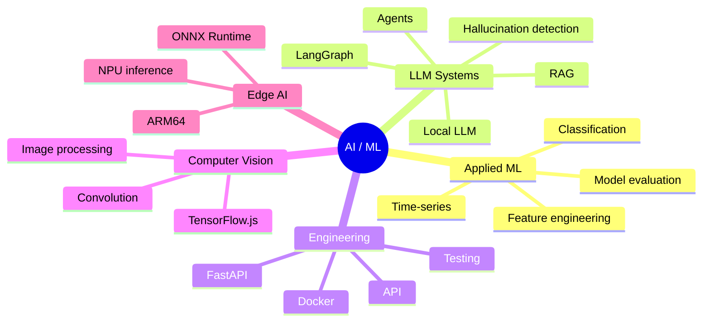

# 你好，我是 Stavr Mariskin 👋

**Junior ML / AI Engineer**  
新西伯利亚国立大学（NSU）一年级学生。主要关注应用机器学习、LLM 系统、RAG、AI Agent、模型评估和推理部署。

**语言:** [English](README.md) · [Русский](README.ru.md) · [中文](README.zh.md)

---

## 关于我

我正在 **Machine Learning / AI Engineering** 方向发展，重点关注将机器学习模型或 LLM 系统放到清晰的工程场景中：包括质量评估、API、演示界面、可复现的启动方式和文档。

我目前特别感兴趣的方向包括：

- LLM 幻觉检测与模型质量评估；
- RAG 与 agentic workflows；
- 面向实际任务的 applied ML；
- 时间序列预测；
- 受限环境中的模型推理与部署；
- 计算机视觉与图像处理。

---

## 技术栈

### ML / Data Science
`Python` `PyTorch` `CatBoost` `scikit-learn` `Logistic Regression` `PCA` `TF-IDF` `LSTM` `feature engineering`

### LLM / RAG / Agents
`LangGraph` `LangChain` `ChromaDB` `Ollama` `Qwen` `GigaChat API` `OpenRouter` `MCP` `RAG` `embeddings` `reranking`

### Backend / Tools
`FastAPI` `Django` `Django REST Framework` `Docker` `Docker Compose` `pytest` `Git` `Linux`

### CV / Low-level / Edge AI
`C` `image processing` `TensorFlow.js` `ONNX Runtime` `ARM64 Linux` `NPU inference`

---

## 成就

- IT Purple Hack 2026 Avito 赛道第 2 名
- Sber 赛道第 3 名：GigaChat 幻觉检测方案
- Cloud.ru Hackathon 第 3 名
- T1 Hackathon 第 3 名

---

## 主要项目

### Guardian of Truth — GigaChat 幻觉检测

**仓库:** [Ultramind-67/purple_hack_sber](https://github.com/Ultramind-67/purple_hack_sber)

一个用于检测 GigaChat 回答中事实性幻觉的竞赛 ML 方案。  
该方案不依赖外部 LLM-as-a-judge，也不依赖 RAG，而是分析模型内部信号。

项目中使用了：

- hidden-state probing；
- teacher forcing；
- contrast directions；
- PCA 压缩表示；
- 来自 logits 的 uncertainty features；
- 轻量级 Logistic Regression 分类器。

**结果:**

- Sber 赛道第 3 名；
- public PR-AUC: 0.8493；
- private PR-AUC: 约 0.8541。

**技术栈:** Python, PyTorch, scikit-learn, PCA, Logistic Regression, GigaChat, hidden-state features.

---

### Avito Split Detector — 面向广告分类的混合 ML 服务

**仓库:** [Ultramind-67/avito_hack_solution](https://github.com/Ultramind-67/avito_hack_solution)

Avito case 的黑客松方案：系统判断一个维修服务广告是否应该拆分成多个独立服务广告，并可选择生成新的广告草稿。

解决方案架构：

- rule-based 微类别检测器；
- TF-IDF 文本特征；
- 手工构造的 meta-features；
- CatBoost 分类器；
- FastAPI API；
- 通过 OpenRouter 进行可选的 LLM 草稿生成；
- 无外部 LLM API 的 fallback 模式。

**结果:**

- 赛道第 2 名；
- historical hold-out F1: 0.70；
- Split 类 Precision: 0.81。

**技术栈:** Python, CatBoost, scikit-learn, TF-IDF, FastAPI, OpenRouter, pytest.

---

### LocalScript AI Agent — 用于 Lua 脚本的离线 LLM Agent

**仓库:** [Ultramind-67/lua-ai-agent](https://github.com/Ultramind-67/lua-ai-agent)

一个本地 agent 系统，用于为 LowCode 平台生成、验证并迭代改进 Lua 脚本。

该项目面向隔离环境开发：系统无需互联网，也不使用外部 LLM 提供商 API。

主要组件：

- 通过 Ollama 进行本地推理；
- Qwen2.5-Coder 7B，4-bit 量化；
- LangGraph pipeline；
- 使用 `luac` 进行语法检查；
- 使用 `luacheck` 进行静态分析；
- 用于修复错误的 self-reflection loop；
- 基于 keyword scoring 的轻量级 RAG；
- FastAPI backend 和简单 web 界面；
- Docker Compose 启动。

**技术栈:** Python, FastAPI, LangGraph, Ollama, Qwen2.5-Coder, Lua, luac, luacheck, Docker.

---

### CdekStart RAG Agent — 上下文 RAG 聊天机器人

**仓库:** [stavrmoris/cdek_rag_bot](https://github.com/stavrmoris/cdek_rag_bot)

一个用于国际实习规则咨询的 RAG 聊天机器人服务。  
项目基于 FastAPI、LangGraph 和 ChromaDB 构建。

实现内容：

- 通过 `thread_id` 实现有状态对话记忆；
- 基于本地向量数据库的 RAG 检索；
- 按地点进行 metadata filtering；
- 在回答问题和提出澄清问题之间进行 smart routing；
- 通过 adapter 支持不同 LLM；
- Docker Compose 启动。

**技术栈:** Python, FastAPI, LangGraph, LangChain, ChromaDB, HuggingFace Embeddings, Docker.

---

### Demand Forecasting ML Service — 需求预测

**仓库:** [stavrmoris/LSTM_m5_NSU](https://github.com/stavrmoris/LSTM_m5_NSU)

NSU 的教学项目：基于销售时间序列构建商品需求预测 ML 服务。

项目实现了一个小型 ML 服务的完整流程：

- 数据准备；
- `mean-28` baseline；
- 基于 PyTorch 的 Global LSTM；
- 在 holdout period 上评估；
- 用于推理的 FastAPI backend；
- 用于预测可视化的 React dashboard；
- Docker Compose 启动。

**结果:**

- 相比 baseline，MAE 约提升 16.8%。

**技术栈:** Python, PyTorch, LSTM, pandas, scikit-learn, FastAPI, React, Docker.

---

### Orange Pi 6 Plus Alt Linux NPU — 在 NPU 上运行 ML 推理

**仓库:** [Ultramind-67/orange-pi-6-plus-alt-linux-npu](https://github.com/Ultramind-67/orange-pi-6-plus-alt-linux-npu)

为 NSU AI Center 完成的项目，位于 ML inference、ARM64 Linux 和 edge AI 的交叉方向。  
目标是在 Orange Pi 6 Plus 上运行 Alt Linux，并使用硬件 NPU 执行神经网络模型。

项目涉及：

- 在 ARM64 开发板上运行 Alt Linux；
- 使用 CIX/Orange Pi vendor BSP kernel；
- 配置 NPU 驱动；
- CIX NOE SDK；
- 用于 inference 的 Python 环境；
- ONNX Runtime Zhouyi；
- 通过硬件 NPU 运行 ResNet50。

**技术栈:** Alt Linux, ARM64, Linux kernel, CIX NOE SDK, ONNX Runtime Zhouyi, Python, Conda, NPU inference.

---

### imgproc — C 语言图像处理库

**仓库:** [stavrmoris/imgproc](https://github.com/stavrmoris/imgproc)

NSU 教学项目：一个用于基础图像处理的命令行应用和 C 语言库。

实现内容：

- median filter；
- Gaussian blur；
- Sobel edge detection；
- sharpen；
- 任意 2D convolution；
- CLI interface；
- Makefile build；
- unit tests。

**技术栈:** C, Makefile, stb_image, image processing, convolution filters, unit tests.

---

### Dion Background Lab — 浏览器中的实时计算机视觉

**仓库:** [Ultramind-67/solution_T1_hack](https://github.com/Ultramind-67/solution_T1_hack)

一个用于视频通话动态背景替换的黑客松原型。  
应用在浏览器中运行：获取摄像头视频、分割人物，并通过 Canvas 渲染最终画面。

实现内容：

- 摄像头视频处理；
- 使用 TensorFlow.js 进行人物分割；
- 多种背景替换模式；
- blur、图片和视频背景；
- FPS counter；
- Docker/nginx 启动。

**结果:** T1 Hackathon 第 3 名。

**技术栈:** JavaScript, TensorFlow.js, Canvas API, HTML, CSS, Docker, nginx.

---

### AI Procurement Agent — 多 Agent 采购系统

**仓库:** [Ultramind-67/hack_mcp_cloud_ru](https://github.com/Ultramind-67/hack_mcp_cloud_ru)

一个用于自动化采购流程的黑客松 multi-agent 方案。  
系统结合了 LLM、RAG memory、web search、供应商网站 scraping、物流计算和报表生成。

实现内容：

- MCP architecture；
- ReAct-style agent loop；
- 供应商搜索；
- 通过 Jina AI 分析网站；
- 基于 ChromaDB 的 RAG memory；
- 集成 DPD SOAP/XML API；
- CSV 报表生成；
- Streamlit dashboard。

**结果:** Cloud.ru Hackathon 第 3 名。

**技术栈:** Python, FastMCP, AsyncIO, ChromaDB, Qwen, Jina AI, SOAP/XML, Streamlit, Docker.

---

## Interest Map

---

## Current Interests

- ML Engineering;
- LLM / RAG Engineering;
- AI agents;
- model evaluation;
- inference services;
- applied ML;
- projects at the intersection of models and backend engineering.

---

## Contacts

- Telegram: [@stavrmoris](https://t.me/stavrmoris)
- Email: `s.mariskin@g.nsu.ru`
- GitHub: [github.com/stavrmoris](https://github.com/stavrmoris)
